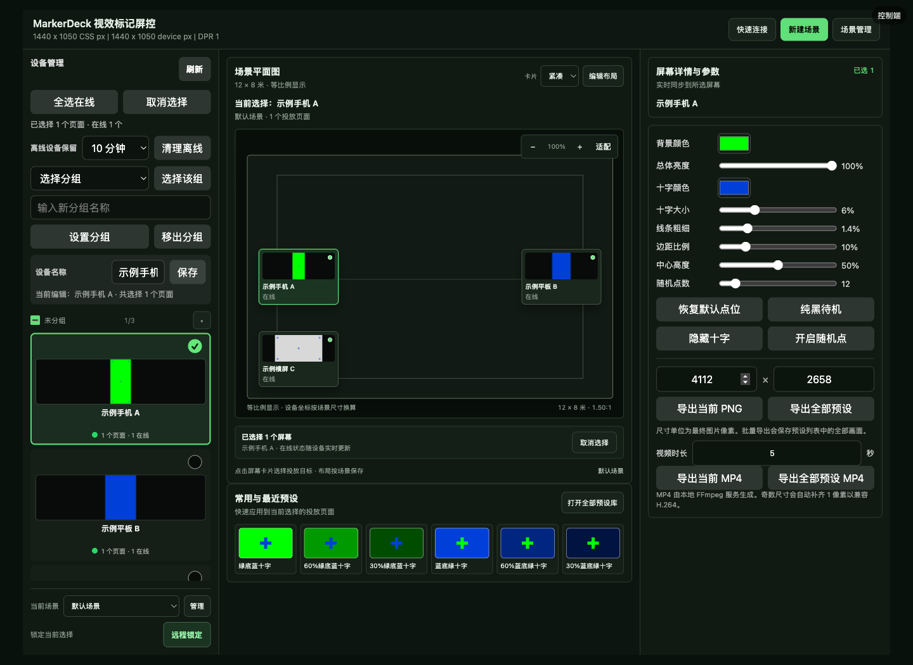

# MarkerDeck

面向影视现场的局域网多屏纯色与跟踪点投放控制工具。

[](https://github.com/Andrower/MarkerDeck/releases/latest)
[](https://github.com/Andrower/MarkerDeck/actions/workflows/check.yml)
[](https://github.com/Andrower/MarkerDeck/actions/workflows/android-check.yml)
[](LICENSE)

## 下载

前往 [最新 Release](https://github.com/Andrower/MarkerDeck/releases/latest)，在 Assets 中选择对应平台的文件：

| 平台与入口 | Release 文件名 | 说明 |
| --- | --- | --- |
| [Windows 桌面客户端 ZIP](https://github.com/Andrower/MarkerDeck/releases/latest) | `MarkerDeck.Client.<版本号>.zip` | Electron 全屏控制端；必须完整解压到文件夹后运行 `MarkerDeck.exe`，不要只移动 EXE。 |
| [Windows 浏览器服务端 ZIP](https://github.com/Andrower/MarkerDeck/releases/latest) | `markerdeck-windows-x64-v<版本号>.zip` | 解压后运行 `start-markerdeck-server.bat`，用浏览器打开控制端。 |
| [macOS ARM64 ZIP](https://github.com/Andrower/MarkerDeck/releases/latest) | `markerdeck-macos-arm64-v<版本号>.zip` | 适用于 Apple Silicon；解压后运行 `start-markerdeck-server.command`。 |
| [Android APK](https://github.com/Andrower/MarkerDeck/releases/latest) | `markerdeck-android-debug-v<版本号>.apk` | 当前为 debug 签名 APK，适合测试和现场试用。 |

Windows 桌面客户端 ZIP 内含 Electron、Node.js 和 FFmpeg 运行时，完整解压后才能正常启动。Android 当前 APK 使用 debug 签名，不代表正式商店发布包。历史版本见 [GitHub Releases](https://github.com/Andrower/MarkerDeck/releases)。

## 核心场景

MarkerDeck 适合需要让多台手机、平板或电脑同步显示纯色背景和跟踪标记的拍摄现场。控制端在同一局域网内管理投放端，修改画面后实时同步到选中的页面。

主要能力：

- 绿色、蓝色、浅灰色背景，以及自定义背景色和十字颜色
- 总体亮度、十字大小、线条粗细、边距、中心高度和随机点数量调整
- 纯色待机、隐藏十字、随机跟踪点和自定义预设
- 查看投放端在线状态、画面缩略图、分组、重命名和批量控制
- 同一物理设备的多个接收页面折叠管理，也可展开后独立选择
- 远程锁定、快捷键解锁、PNG 导出和本地 FFmpeg MP4 导出

## 三种使用模式

启动页和 Android 模式页都提供三个入口，按当前设备承担的角色选择：

- **本地投放（local）**：只在当前设备显示投放画面，不需要外部宿主。手机或平板解锁后可直接调整背景颜色、总体亮度、十字颜色/大小等常用参数，也可使用快捷预设、锁定和退出。
- **连接局域网宿主（display）**：把当前设备作为被控端连接同一局域网的 MarkerDeck 宿主。手机被控端不显示场景工作台，只保留必要的快速调节和预设入口；控制端的参数与锁定状态会按现有同步流程下发。
- **本机作为宿主（control）**：Android 启动内置局域网宿主并打开本机控制页，电脑、平板或其他手机可通过显示的地址/二维码加入。桌面/平板控制端使用场景工作台管理设备分组、场景平面图、预设和参数，手机控制端保留设备选择、批量锁定和必要控制。

### Android 本机作为宿主

1. 安装 APK，打开后在模式页选择 **本机作为宿主**；内置服务以 Android 前台服务运行，设置页会显示本机局域网地址。
2. 在本机宿主控制页的“快速连接”区域查看地址和二维码；让控制端和被控端加入同一 Wi-Fi 或手机热点，在启动页打开该地址，或扫描二维码。启动页的按钮名称为“进入控制端”和“进入被控端”。
3. 需要让这台 Android 只显示画面时，返回模式页选择 **本地投放**；需要连接其他电脑或手机宿主时，选择 **连接局域网宿主**，使用自动发现、扫码或手动地址。
4. 宿主服务可从 Android 设置页或常驻通知停止。当前 Release APK 为 debug 签名测试包，跨版本安装前请按发布说明确认签名与数据保留条件。

场景文档仅保存在当前浏览器的版本化 `localStorage` 中，不会随宿主服务或设备自动同步。Android 本机作为宿主时，控制页仍加载共享网页资源；投放协议、设备身份、锁定 ACK、状态同步和导出格式保持不变。
Android 本机作为宿主的控制页会为状态栏和刘海安全区预留顶部空间；切换到本地或远程投放时恢复沉浸式全屏。

## 快速开始

1. 下载对应平台的 ZIP 或 Android APK；Windows 桌面 ZIP 必须完整解压。
2. 启动服务：Windows 浏览器包运行 `start-markerdeck-server.bat`，macOS 运行 `start-markerdeck-server.command`；桌面客户端直接运行 `MarkerDeck.exe`。
3. 在电脑打开 `http://localhost:8765/markerdeck-launch.html`，或使用启动页显示的局域网地址。
4. 让手机、平板或另一台电脑连接同一局域网或手机热点，打开启动页地址；Android 默认启动会短暂扫描并询问是否连接发现的宿主，拒绝后仍可在模式页手动选择“连接局域网宿主”或“本地投放”。
5. 回到控制端选择设备，调整画面、应用预设或锁定投放。

手机和平板必须使用启动页显示的局域网地址，不能把 `localhost` 或 `127.0.0.1` 作为远程设备地址。端口被占用时，macOS 启动脚本会选择后续可用端口；防火墙需要允许服务使用 HTTP 端口和 UDP `8766`。

## 真实界面预览

控制端工作区由三部分组成：左侧选择设备与分组，中间按场景比例布局投放页面并提供常用预设，右侧集中处理颜色、亮度、点位和导出参数。页面使用当前仓库的真实 HTML/CSS/JavaScript 控制端，不依赖第三方云服务。



图中设备名称和连接地址均为脱敏的演示数据。

## 平台能力

| 能力 | Windows 桌面客户端 | Windows 浏览器服务端 | macOS ARM64 | Android APK |
| --- | --- | --- | --- | --- |
| 控制端与投放端 | 支持 | 支持 | 支持 | 支持 |
| 局域网发现 | mDNS + UDP | mDNS + UDP | mDNS + UDP | mDNS + UDP；作为宿主时发布 |
| PNG 导出 | 支持 | 支持 | 支持 | 宿主控制页支持 |
| MP4 导出 | 支持，内置 FFmpeg | 支持，内置 FFmpeg | 支持，按本机 FFmpeg 可用性 | 不支持 |
| 桌面全屏、置顶和按键拦截 | 支持 | 由浏览器决定 | 由浏览器决定 | 使用 Android 投放窗口 |
| Android 前台宿主 | 不适用 | 不适用 | 不适用 | 支持 |
| 场景工作台 | 支持（控制端） | 支持（浏览器控制端） | 支持（浏览器控制端） | 支持（本机作为宿主的控制页） |
| 手机被控端快速调节 | 浏览器可用 | 浏览器可用 | 浏览器可用 | 本地投放/连接宿主可用 |

## 网络与锁定边界

- 控制服务默认只在本机和当前局域网中运行；设备状态、控制指令和预设不需要上传到第三方云服务。不要把服务端口直接暴露到公网。
- 局域网发现同时使用 DNS-SD `_markerdeck._tcp.local` 和 UDP `8766`；发现到的地址还会通过观测地址上的 nonce 作用域 HTTP 握手验证。电脑与投放设备应连接同一个局域网或手机热点。路由器可能隔离 mDNS，UDP 与手动地址仍是回退路径。
- `localhost` 只表示当前设备。手机连接电脑服务时，应使用启动页给出的局域网 IP 或二维码地址，不能使用电脑上的 `localhost`。
- 网页和桌面客户端可以拦截常见的退出、刷新、返回和全屏快捷键，但普通应用无法完全拦截操作系统保留按键。
- Windows 键、`Ctrl + Alt + Delete`、电源键等系统级操作不能由普通网页或应用完全禁用；严格封闭的拍摄设备需要配合 Windows Assigned Access、组策略或系统级 kiosk 模式。
- `Ctrl + Alt + Shift + L` 会在当前服务内广播锁定或解锁全部在线投放端；控制面板的远程锁定按钮只作用于选中的设备或分组。
- MP4 导出由本地 FFmpeg 完成。Windows 发布包内含 FFmpeg；macOS 会依次查找捆绑 FFmpeg、Homebrew 和系统 `PATH`。

## 开发快速开始

项目使用原生 HTML/CSS/JavaScript、Node.js 本地服务、Electron Windows 客户端和独立 Android 工程。推荐 Node.js 24。

```bash
npm start
npm test
node scripts/check-project.js
```

Android 工程需要 JDK 17 或更高版本：

```bash
cd android
./gradlew testDebugUnitTest lintDebug assembleDebug
```

页面和服务端共享 `src/web`，发布 ZIP、Node.js 和 FFmpeg 运行时不提交到普通 Git 历史，而是由 GitHub Actions 组装并上传到 Release。完整的目录结构、资源加载顺序和发布流程见 [项目结构与架构](docs/architecture.md)。

## 文档索引

- [项目结构与架构](docs/architecture.md)
- [Windows 使用说明](docs/windows.md)
- [macOS 使用说明](docs/macos.md)
- [Electron 桌面客户端](docs/desktop-client.md)
- [视频导出](docs/video-export.md)
- [v1.7.0 发布说明](docs/releases/v1.7.0.md)
- [版本与回滚](docs/rollback.md)
- [Android 开发与构建](android/README.md)
- [改进路线](docs/improvement-roadmap.md)
- [任务记录索引](docs/tasks/README.md)
- [局域网 mDNS 自动发现](docs/tasks/MD-A14.md)

## 许可

项目源码使用 [MIT License](LICENSE)。FFmpeg 及其第三方构建使用各自的许可证；分发包含 FFmpeg 的运行包时必须保留对应许可文件。
